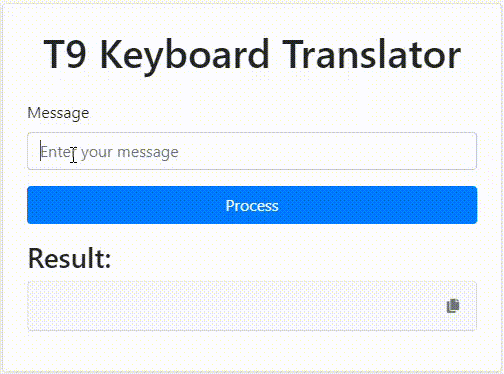

# T9 Keyboard Translator



A web application that encrypts and decrypts messages using the T9 keyboard style, like the classic Nokia 1100. 


## Table of Contents

- [Introduction](#introduction)
- [Features](#features)
- [Getting Started](#getting-started)
  - [Prerequisites](#prerequisites)
  - [Installation](#installation)
  - [Running the Application](#running-the-application)
- [Usage](#usage)
- [Contributing](#contributing)
- [License](#license)

## Introduction

This project provides a web interface to encrypt and decrypt messages using a T9 keyboard pattern. Users can enter messages, which are then processed to mimic typing on an old T9 keyboard.

## Features

- Encrypt messages using T9 keyboard pattern.
- Decrypt T9 encrypted messages.
- Clipboard copy functionality with a modern toast notification.

## Getting Started

### Prerequisites

Before you begin, ensure you have met the following requirements:

- You have Python 3 installed.
- You have `pip` installed.
- Optionally, you have a virtual environment tool such as `venv` or `virtualenv`.

### Installation

1. Clone the repository:

```bash
git clone https://github.com/mayconrfreitas/t9-keyboard-translator.git
cd t9-keyboard-translator
```

2. Create a virtual environment:

```bash
python -m venv venv
```

3. Activate the virtual environment:

- On Windows:
  ```bash
  venv\Scripts\activate
  ```
- On MacOS/Linux:
  ```bash
  source venv/bin/activate
  ```

4. Install the required dependencies:

```bash
pip install -r requirements.txt
```

### Running the Application

1. Start the Flask application:

```bash
python app.py
```

2. Open your web browser and go to:

```
http://127.0.0.1:5000
```

## Usage

- Enter a message in the text area.
- Click "Process" to encrypt or decrypt the message.
- Use the copy button to copy the result to your clipboard.

## Contributing

Contributions are what make the open source community such an amazing place to learn, inspire, and create. Any contributions you make are **greatly appreciated**.

1. Fork the Project
2. Create your Feature Branch (`git checkout -b feature/AmazingFeature`)
3. Commit your Changes (`git commit -m 'Add some AmazingFeature'`)
4. Push to the Branch (`git push origin feature/AmazingFeature`)
5. Open a Pull Request

## License

This project is licensed under the MIT License. See the [LICENSE](LICENSE) file for details.
